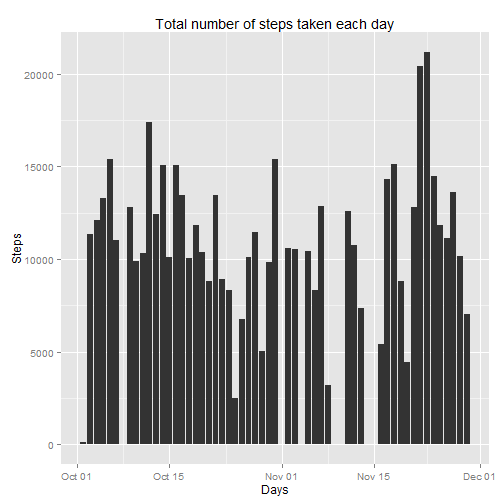
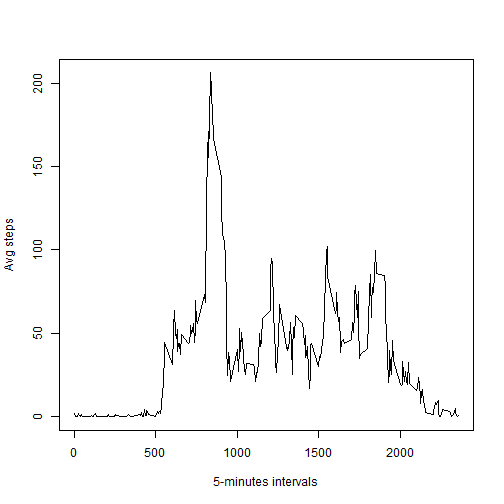
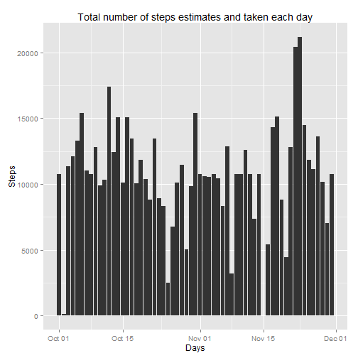
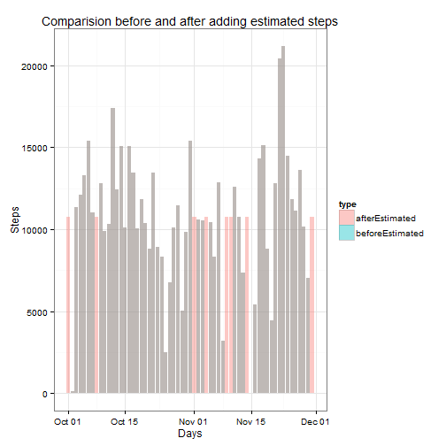
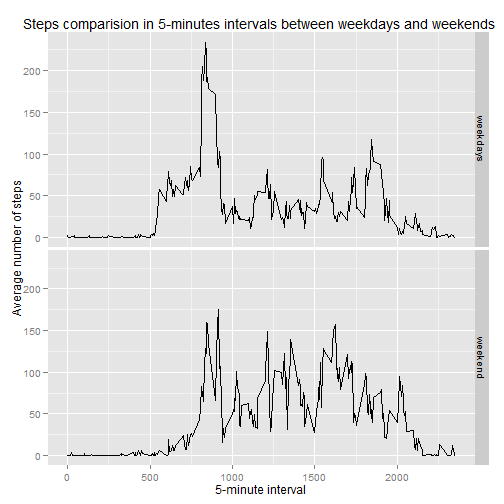

# Reproductibe research

## Peer Assessment 1

This is a data analysis developed by Sergio Aguado as required by the first assignment in the [Reproducible Research course of the Specialization in Data Science by Johns Hopkins University through Coursera](https://www.coursera.org/course/repdata).

Dataset: Activity monitoring data downloaded from [here](https://d396qusza40orc.cloudfront.net/repdata%2Fdata%2Factivity.zip)

The variables included in the dataset are:

* steps: Number of steps taking in a 5-minute interval (missing values are coded as NA)

* date: The date on which the measurement was taken in YYYY-MM-DD format

* interval: Identifier for the 5-minute interval in which measurement was taken

### Loading and preprocessing the data

After unzip the file, read the csv file and format the data.


```r
unzip(zipfile = "./activity.zip")

actData <- read.csv("./activity.csv", header = T, na.strings = c("NA"), 
                        colClasses = c("numeric", "character", "numeric"))
```


### What is mean total number of steps taken per day?
We have to aggregate the steps results by day and removing the NA cases. 

```r
totSteps <- aggregate(steps~date,data=actData,sum,na.rm=TRUE)
totSteps$date <- strptime(totSteps$date, "%Y-%m-%d")
```

1. Make a histogram of the total number of steps taken each day


```r
library(ggplot2)
ggplot(totSteps, aes(x = date, y = steps)) + geom_histogram(stat = "identity")+
        labs(title="Total number of steps taken each day", x="Days", y="Steps")
```

 

2. Calculate and report the mean and median total number of steps taken per day

The mean per day is:

```r
print(mean(totSteps$steps))
```

```
## [1] 10766.19
```

The median per day is: 

```r
print(median(totSteps$steps))
```

```
## [1] 10765
```


### What is the average daily activity pattern?

```r
avgSteps <- aggregate(steps~interval,data=actData,mean,na.rm=TRUE)
```


1. Make a time series plot (i.e. type = "l") of the 5-minute interval (x-axis) and the average number of steps taken, averaged across all days (y-axis)


```r
plot(x = avgSteps$interval, y = avgSteps$steps, type="l" , 
     xlab = "5-minutes intervals", ylab = "Avg steps")
```

 


2. Which 5-minute interval, on average across all the days in the dataset, contains the maximum number of steps?

The interval with the maximum average of steps is: 

```r
print(avgSteps[which.max(avgSteps$steps),], row.names = F)
```

```
##  interval    steps
##       835 206.1698
```


### Imputing missing values
1. Calculate and report the total number of missing values in the dataset (i.e. the total number of rows with NAs)

```r
sum(is.na(actData$steps))
```

```
## [1] 2304
```


2. Devise a strategy for filling in all of the missing values in the dataset.

The strategy will be to fill the missing values with the average of steps for the 
interval we don't have value. The result will be trucated for removing the decimals


3. Create a new dataset that is equal to the original dataset but with the missing data filled in.

```r
actAllData <- actData

for (n in 1:nrow(actAllData)) {
        if (is.na(actAllData$steps[n])) {
                actAllData$steps[n] <- round(mean(avgSteps$steps[avgSteps$interval==actAllData$interval[n]]),0) 
        }
}
head(actAllData)
```

```
##   steps       date interval
## 1     2 2012-10-01        0
## 2     0 2012-10-01        5
## 3     0 2012-10-01       10
## 4     0 2012-10-01       15
## 5     0 2012-10-01       20
## 6     2 2012-10-01       25
```


4. Make a histogram of the total number of steps taken each day and Calculate 
and report the mean and median total number of steps taken per day.

Now we are working with the new data frame "actAllData"

- Total steps per day

```r
totStepsNA <- aggregate(steps~date,data=actAllData,sum)
totStepsNA$date <- strptime(totStepsNA$date, "%Y-%m-%d")
```


The mean per day is:

```r
print(mean(totStepsNA$steps))
```

```
## [1] 10765.64
```

The median per day is: 

```r
print(median(totStepsNA$steps))
```

```
## [1] 10762
```


```r
ggplot(totStepsNA, aes(x = date, y = steps)) + geom_histogram(stat = "identity") +
        geom_histogram(stat = "identity") +
        labs(title="Total number of steps estimates and taken each day", 
             x="Days", y="Steps")
```

 

- Do these values differ from the estimates from the first part of the assignment? 

Yes, as we can see in the following histogram, the distribution of the steps is
different. The dark columns are due to we have the same values in the data frame 
before adding the estimated and in the data frame after adding the estimated steps.
Therefore where we see the bars in light colour is because we have only data in 
the data frame where we have removed the NA cases and estimated the steps.

```r
totSteps$type <- "beforeEstimated"
totStepsNA$type <- "afterEstimated"


totStepsAll <- rbind(totSteps, totStepsNA)

ggplot(totStepsAll, aes(x = date,  y = steps,  fill = type)) +
        geom_histogram(stat = "identity", position = "identity", alpha=0.4) +
        theme_bw() +
        labs(title="Comparision before and after adding estimated steps", 
             x="Days", y="Steps")
```

 


- What is the impact of imputing missing data on the estimates of the total 
daily number of steps?


Both mean and median have been reduced due to the estimated steps we have 
introduced.


```r
stepsMatrix <- matrix(c(mean(totSteps$steps), mean(totStepsNA$steps), 
         median(totSteps$steps), median(totStepsNA$steps)),ncol=2,byrow=TRUE)

colnames(stepsMatrix) <- c("beforeEstimated", "afterEstimated")
rownames(stepsMatrix) <- c("mean", "median")

as.table(stepsMatrix)
```

```
##        beforeEstimated afterEstimated
## mean          10766.19       10765.64
## median        10765.00       10762.00
```


### Are there differences in activity patterns between weekdays and weekends?


```r
#Change the locale due to my locale is in Spain.
Sys.setlocale("LC_TIME", locale="USA")
```

```
## [1] "English_United States.1252"
```

```r
actData$date<- strptime(actData$date, "%Y-%m-%d")
actData$dayType <- weekdays(actData$date)

actData$dayType <- gsub(pattern = "Monday|Tuesday|Wednesday|Thursday|Friday",
                         replacement = "weekdays", x = actData$dayType)
actData$dayType <- gsub(pattern = "Saturday|Sunday", replacement = "weekend",
                        x = actData$dayType)

avgStepsPerDay <- aggregate(actData$steps, list(Interval=as.numeric(as.character
                        (actData$interval)), Weekday= actData$dayType), mean,
                        na.rm=TRUE)

ggplot(avgStepsPerDay, aes(x=Interval, y=x)) + geom_line() +
    facet_grid(Weekday ~ .) +
    labs(title="Steps comparision in 5-minutes intervals between weekdays and weekends ", 
         x="5-minute interval", y="Average number of steps")
```

 

Yes there are differences in the activity patterns between weekdays and weekends.
As it can see, during weekdays the steps stars in a lower intervals than in 
weekends for example.


Author: Sergio Aguado
